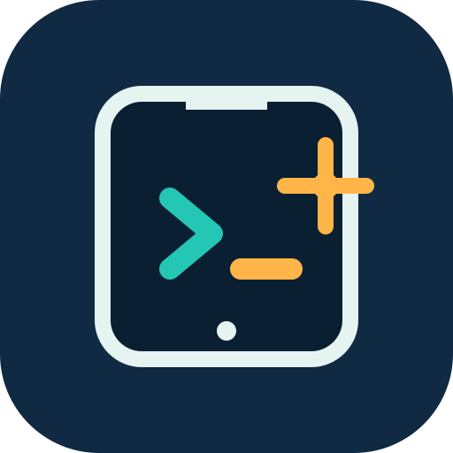

<p align="center">
  
</p>

<h1 align="center">Mob</h1>

<p align="center">
  <strong>Enable mobile development in VS Code with one click.</strong><br />
  Stop manually configuring SDKs, NDKs, JDKs, device bridges, emulators, and environment variables.
</p>

<p align="center">
  <a href="README.md">简体中文</a> · <a href="README-EN.md">English</a>
</p>

<p align="center">
  <a href="https://github.com/xy200303/MobBase/releases"></a>
  <a href="https://github.com/xy200303/MobBase/actions/workflows/release.yml"></a>
  <a href="go.mod"></a>
  
  
</p>

<p align="center">
  <a href="#quick-start">Quick Start</a> ·
  <a href="#why-mob">Why Mob</a> ·
  <a href="#ai-and-automation">AI and Automation</a> ·
  <a href="#vs-code-extension">VS Code Extension</a> ·
  <a href="CONTRIBUTING.md">Contributing</a> ·
  <a href="docs/PRODUCT_PLAN.md">Product Specification</a> ·
  <a href="docs/MANUAL_VALIDATION.md">Manual Validation</a>
</p>

---

## One Entry Point for Mobile Development

Changing machines, SDK versions, or platforms should not mean repeating IDE installation, toolchain downloads, environment-variable setup, and device connection. Mob's goal is to let developers use one CLI or VS Code extension for Android, iOS, and HarmonyOS environment setup, device management, builds, runs, and debugging.

You should not need to remember where an SDK lives, which JDK can build a project, how to create an emulator for a matching API level, or how to run AI-generated code on a real device. Open a project, click **Run**, or execute:

```powershell
mob run --accept-licenses
```

Mob reads the existing project configuration, prepares the matching official toolchain, chooses a physical device or emulator, and invokes the project's own runner. It does not introduce a private project format or replace Gradle, Flutter/FVM, Xcode, or DevEco.

**Android is the currently complete platform.** iOS and HarmonyOS are being integrated through their official toolchains. Android Studio remains useful for layout tooling and Profilers, but is no longer a prerequisite for the normal Android environment and run path. Future iOS and HarmonyOS support will continue to respect Xcode, DevEco, account, signing, and host-system requirements.

## Why Mob

| Common problem | What Mob does |
| --- | --- |
| A new machine has no SDK, ADB, JDK, or emulator | Prepares missing components from official catalogs after licence confirmation. |
| VS Code requires manual SDK paths, PATH edits, and environment variables | The CLI and extension share Mob-managed toolchains; environments are injected only into the build process. |
| One project needs API 27 while another needs API 35, a different NDK, or another JDK | Derives requirements from the active project's Gradle configuration and selects the matching toolchain. |
| Android, iOS, and HarmonyOS use disconnected tool and device entry points | Uses shared platform namespaces, a device model, and workflows while adapters are delivered through official capabilities. |
| AI coding tools have to guess local state and command results | Provides stable `--json`, `--json=events`, error codes, and UI automation commands. |

Mob does not create `mob.yaml`, rewrite `build.gradle`, Flutter configuration, or `.fvmrc`, or permanently set `JAVA_HOME`, `ANDROID_HOME`, or `ANDROID_SDK_ROOT`. It manages its own files under `~/.mob` by default.

## Current Scope

| Platform | Status | Current capabilities |
| --- | --- | --- |
| Android | Delivered | SDK, NDK, JDK, ADB, Emulator, physical devices, Flutter/FVM, build, run, debug, test, logs, release builds, and VS Code device preview. |
| iOS | In progress | Shared commands and device protocol are reserved; support will be implemented incrementally with macOS, Xcode, Simulator, and Apple-supported services. |
| HarmonyOS | In progress | Shared commands and device protocol are reserved; support will be implemented incrementally through DevEco, HarmonyOS SDK, and HDC capabilities. |

You can use Mob for Android development in VS Code today. Later platforms will not reuse Android tooling or bypass official Xcode, DevEco, account, signing, or host-system requirements.

## Installation

The installer downloads and verifies the Release binary for the current host. Go is not required. It installs to `~/.mob/bin` by default and adds that directory to the current user's `PATH`.

### Windows PowerShell

```powershell
irm https://raw.githubusercontent.com/xy200303/MobBase/main/scripts/install.ps1 | iex
```

### macOS / Linux

```bash
curl -fsSL https://raw.githubusercontent.com/xy200303/MobBase/main/scripts/install.sh | bash
```

Confirm the installation:

```powershell
mob --version
mob help
```

To install a specific Release or choose another directory, download the script first:

```powershell
irm https://raw.githubusercontent.com/xy200303/MobBase/main/scripts/install.ps1 -OutFile install-mob.ps1
.\install-mob.ps1 -Version latest -InstallDir D:\tools\mob\bin
```

```bash
curl -fsSLO https://raw.githubusercontent.com/xy200303/MobBase/main/scripts/install.sh
bash install.sh --version latest --install-dir "$HOME/.local/bin"
```

Verified downloads are cached in `~/.mob/cache/releases`. See the [PowerShell](scripts/install.ps1) and [Bash](scripts/install.sh) installers.

## Quick Start

Android is ready today.

### Open an Existing Android Project in VS Code

Install Mob, then open the project directory in VS Code. Use the Mob extension's toolchain and device views, or run this in the integrated terminal:

```powershell
mob doctor
mob run --accept-licenses
```

`mob run` detects the current project. For native Android, it uses the project's Gradle Wrapper. For Kotlin Multiplatform/KUIKLY Android projects, it finds the single Android application module, runs `:<module>:installDebug`, then starts that module's `applicationId` through ADB. For Flutter Android targets, it uses the project's Flutter or FVM workflow. If SDK Platforms, Build Tools, NDK, JDK, ADB, or Emulator are missing, Mob prepares components that can be installed after licence confirmation. If no device is available, it can create a Mob-managed AVD matching the project API level.

### Create and Run a Native Android Project

```powershell
mob android create notes --language kotlin --ui compose --min-sdk 24
cd notes
mob run --accept-licenses
```

This creates a standard Gradle project. Mob reuses system Gradle when available; otherwise, it downloads a verified Gradle distribution to generate the wrapper. `mob build`, `mob run`, `mob test`, and `mob release` then use the project's own Gradle Wrapper.

### Keep Multiple Project Versions Working

```powershell
cd C:\work\legacy-api-27
mob run --accept-licenses

cd C:\work\modern-api-35
mob debug --accept-licenses
```

Mob selects the SDK, Build Tools, NDK, and JDK for the current project and injects them only into that process. Running an old project does not break a newer one, and vice versa.

### Connect a Device or Emulator

```powershell
mob device list
mob device use android:emulator-5554
mob run
```

For Android wireless debugging:

```powershell
mob android device pair 192.168.1.20:37123 --code 123456
mob android device connect 192.168.1.20:5555
mob device use android:192.168.1.20:5555
mob run --mirror
```

## VS Code Extension

Run with a click.

[Mob for VS Code](https://marketplace.visualstudio.com/items?itemName=xiaoyun.mob-vscode) is the CLI's visual entry point. The extension does not scan SDK directories or directly invoke ADB or Emulator; the same `mob` CLI owns environment, device, and workflow operations.

The Mob Activity Bar view can:

- Show Android SDK, JDK, Flutter, and device diagnostics.
- Create standard Android or Flutter projects.
- Install SDK, NDK, and system images, and create, start, or stop Android emulators.
- Run, build, test, debug, follow logs, and create release artifacts.
- Pair wireless devices, select the default device, and open a device preview in the editor.

Device Preview is an H.264 video stream, not screenshot polling. Android physical devices and emulators can be displayed in VS Code, with tap, swipe, text input, Back, Home, and Recent Apps controls. Sessions listen only on `127.0.0.1` and use a short-lived token; closing the panel removes temporary ADB forwarding and helper processes.

When the extension cannot find the CLI, set `mob.path` to the `mob` command or an absolute executable path. See the [extension documentation](extensions/vscode-mob/README.md) for details.

## AI and Automation

Give AI an interface that can actually run a project.

Mob has readable terminal output for people and a machine interface for AI, editor extensions, and CI. Tools can determine the current environment, progress, and next action without parsing unstable error prose:

```powershell
mob help run --format json
mob status --json
mob catalog --platform android --json
mob run --accept-licenses --json=events
```

| Mode | Use | stdout contract |
| --- | --- | --- |
| Default text | A developer in a terminal | Human-readable result; stage and progress information go to stderr. |
| `--json` | Queries and bounded workflows | One terminal JSON object with `schemaVersion`, `event`, `ok`, and `data` or `error`. |
| `--json=events` | Long-running build, run, debug, and logs workflows | JSON Lines event stream with no progress bars or external-tool output mixed in. |

For Android today, an AI can read command capabilities and state, prepare the environment, build, run, debug, and inspect a device UI. The same interface will grow to other platforms as their adapters are delivered:

```powershell
mob doctor --fix --accept-licenses --json=events
mob run --accept-licenses --json=events
mob device screenshot android:emulator-5554
mob device ui-tree android:emulator-5554 --json
```

Error objects contain stable error codes and remediation. For example, `MOB_LICENSE_REQUIRED` means a developer must explicitly accept Android SDK licences; an AI or extension can request that confirmation rather than accepting licences on the user's behalf.

Use `--` to forward a specialised official project command. Mob still handles platform validation, device selection, and one-process environment injection:

```powershell
mob run --device android:emulator-5554 -- .\gradlew.bat installDebug
```

See the [product specification](docs/PRODUCT_PLAN.md) for the complete event and error-code contract, and the [device session protocol](docs/MOB_DEVICE_SESSION_PROTOCOL.md) for preview details.

## Common Commands

| Goal | Command |
| --- | --- |
| Version and help | `mob --version`, `mob help`, `mob help <command> --format json` |
| Status and diagnosis | `mob status`, `mob doctor`, `mob doctor --fix --accept-licenses` |
| Installable components | `mob catalog --platform android`, `mob android sdk available`, `mob android ndk available` |
| Android SDK management | `mob android sdk list`, `mob android sdk install managed --api 35 --accept-licenses` |
| Emulator management | `mob android emulator image available`, `mob android emulator create`, `mob android emulator start` |
| Device management | `mob device list`, `mob device use <platform:native-id>` |
| Daily project workflows | `mob build`, `mob run`, `mob debug`, `mob test`, `mob logs --follow` |
| Android release artifacts | `mob release --platform android --artifact aab` |
| Device inspection and automation | `mob device screenshot`, `mob device ui-tree --json`, `mob device wait --idle` |

## Safety and Boundaries

- Android SDK licences require explicit `--accept-licenses` confirmation.
- Mob removes only components it manages within `MOB_HOME`; discovered and imported external toolchains are always read-only.
- `mob support bundle` creates a redacted Mob diagnostic package without project files, secrets, environment variables, proxy settings, or raw host paths.
- iOS and HarmonyOS are not complete delivery targets yet. Mob does not pretend to provide cross-platform builds, signing, device control, or releases before the relevant official adapter exists.

## Development and Validation

```powershell
go test ./... -count=1 -timeout 60s
go test -race ./... -count=1 -timeout 120s
go vet ./...

cd extensions/vscode-mob
npm ci
npm run compile
```

For real Android environment validation, see the [manual validation checklist](docs/MANUAL_VALIDATION.md). For completed checks and remaining risks, see the [test report](docs/TEST_REPORT_2026-07-30.md).

## Roadmap

1. Expand real Android project, emulator, physical-device, enterprise-network, and signed-release validation.
2. Continue improving Android project detection and toolchain compatibility.
3. Integrate iOS toolchain and device workflows through Xcode on macOS.
4. Integrate HarmonyOS toolchain and device workflows through DevEco and public official SDKs.

## Open Source Collaboration

Bug reports, device-compatibility feedback, project-detection cases, and documentation improvements are welcome. Read [Contributing](CONTRIBUTING.md) before submitting code. This project is available under the [MIT License](LICENSE).
